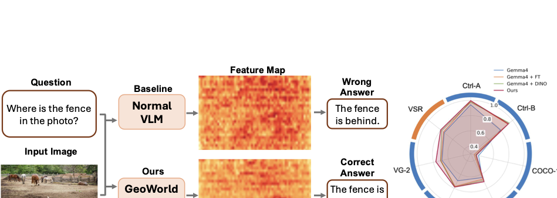
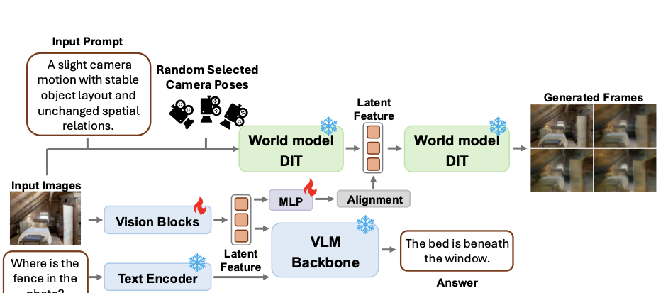
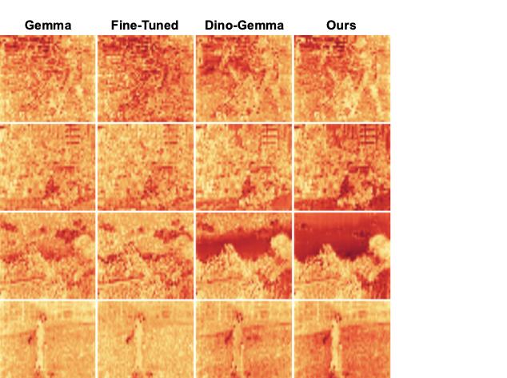

# AdaptVis

Official implementation for **AdaptVis: World-Model-Guided Visual Alignment for Spatial Reasoning in Vision-Language Models**.

This repository contains the training and evaluation code used for our spatial reasoning experiments with Gemma4 and LingBot-World-Fast. The core idea is to improve a vision-language model's spatial representations by aligning its visual features to a frozen world-model teacher while preserving the original VLM behavior. The repository is organized for reproducibility: data preparation, model paths, training scripts, checkpoint export, and evaluation are separated into configurable entry points.

> Paper, pretrained checkpoints, and full data links will be added after release.

## Overview

Given an input image and a spatial reasoning question, AdaptVis enhances the spatial understanding of standard VLMs by injecting world-model priors at the feature-map level. Compared with original VLM features, AdaptVis produces more geometry-aware representations that improve spatial grounding and answer accuracy across diverse benchmarks.



*Figure 1. Overview. AdaptVis injects world-model priors into VLM visual features, producing more geometry-aware representations and stronger spatial reasoning performance than strong baselines (raw Gemma-4, task-only fine-tuning, and DINO-augmented fine-tuning) on benchmarks such as What’sUp and VSR.*

## Method at a Glance

During training, AdaptVis fine-tunes only the VLM vision stack, including the vision encoder and multimodal projector. It aligns latent features from the VLM encoder with intermediate world-model representations, where the world model takes the input image, text prompt, and randomly sampled camera poses as input. At inference time, the world model is no longer needed, and AdaptVis runs as standard VLM inference.



*Figure 2. GeoWorld-VLM. Training aligns VLM visual features with world-model intermediates while updating only vision-related blocks; inference does not require the world model.*

## Results Snapshot

On the What’sUp + VSR suite, AdaptVis consistently improves spatial reasoning across sub-benchmarks, outperforming the original VLM, task-only fine-tuning, and static DINOv3-feature distillation.



*Figure 4. Overall comparison on the What’sUp + VSR suite. GeoWorld-VLM shows consistent gains across diverse spatial reasoning sub-benchmarks.*

## Repository Layout

```text
.
├── README.md
├── requirements.txt
├── configs/
│   └── paths.example.env
├── figures/
│   └── README.md
├── scripts/
│   ├── export_conda_env.sh
│   ├── train_single_image_whatsup_vsr.sh
│   ├── train_single_image_embspatial.sh
│   ├── train_double_image_sat.sh
│   ├── export_hf_checkpoint.sh
│   ├── eval_raw_model.sh
│   └── eval_ours_model.sh
└── code/
    ├── training/
    │   ├── train_gemma4_lingbot_spatial.py
    │   ├── train_embspatial_gemma4_lingbot_spatial.py
    │   ├── train_sat_gemma4_lingbot_double_image_qtype.py
    │   ├── gemma4_lingbot_spatial_model.py
    │   ├── export_hf_model.py
    │   └── dataset_*.py
    └── evaluation/
        ├── eval_gemma.py
        ├── eval_embspatial_gemma.py
        └── eval_sat_gemma_qtype.py
```

## Installation

We recommend using a fresh conda environment with CUDA-enabled PyTorch.

```bash
conda create -n adaptvis python=3.12 -y
conda activate adaptvis
pip install -r requirements.txt
```

Install any extra dependencies required by your local LingBot-World-Fast checkout following the LingBot-World instructions.


## Models

Download or prepare the following local model directories:

- **Gemma4 VLM**: base VLM used as the student and for raw evaluation.
  - https://huggingface.co/google/gemma-4-E4B-it
- **LingBot-World-Fast**: frozen world-model teacher used for feature alignment.
  - https://huggingface.co/robbyant/lingbot-world-fast

Create a local path config:

```bash
cp configs/paths.example.env configs/paths.local.env
```

Then edit:

```bash
export GEMMA_MODEL="/path/to/gemma-4-E4B-it"
export LINGBOT_MODEL="/path/to/lingbot-world-fast"
export LINGBOT_CODE="/path/to/lingbot-world"
export OUTPUT_DIR="/path/to/outputs"
export RESULTS_DIR="/path/to/results"
```

The code assumes offline/local loading by default (`HF_DATASETS_OFFLINE=1`, `TRANSFORMERS_OFFLINE=1`, `HF_HUB_OFFLINE=1`). If you want to download models through Hugging Face at runtime, disable those environment variables in your shell.

## Data

Set the following paths in `configs/paths.local.env`.

### WhatsUp + VSR

Download path:

- https://github.com/shiqichen17/AdaptVis

Expected variables:

```bash
export ADAPTVIS_DATA_DIR="/path/to/data"
export ADAPTVIS_PROMPTS_DIR="/path/to/prompts"
```

The training/evaluation code expects the data and prompt files used by `dataset_adaptvis_mcq.py`, including:

- `Controlled_Images_A`
- `Controlled_Images_B`
- `COCO_QA_one_obj`
- `COCO_QA_two_obj`
- `VG_QA_one_obj`
- `VG_QA_two_obj`
- `VSR`

The split file should be placed at:

```text
splits/data_split.json
```

or passed through `SPLIT_FILE=/path/to/data_split.json`.

### EmbSpatial

Download path:

- https://huggingface.co/datasets/FlagEval/EmbSpatial-Bench

Expected variables:

```bash
export EMBSPATIAL_JSON="/path/to/embspatial.json"
```

The split file should be placed at:

```text
splits/embspatial_split.json
```

or passed through `SPLIT_FILE=/path/to/embspatial_split.json`.

### SAT

Download path:

- https://huggingface.co/datasets/array/SAT-v2

Expected variables:

```bash
export SAT_ROOT="/path/to/sat_DATA"
```

The SAT root should contain the `val` and `test` splits loadable by `datasets.load_from_disk`. The split file should be placed at:

```text
splits/sat_split.json
```

or passed through `SPLIT_FILE=/path/to/sat_split.json`.

To create a SAT split:

```bash
PYTHONPATH=code:code/training python code/training/make_sat_split.py \
  --sat-root "$SAT_ROOT" \
  --output splits/sat_split.json \
  --train-size 2000 \
  --val-eval-size 1000 \
  --seed 42
```

## Training

All scripts read `configs/paths.local.env`. Most hyperparameters can be overridden through environment variables.

### Single-Image Training: WhatsUp + VSR

```bash
bash scripts/train_single_image_whatsup_vsr.sh
```

Useful overrides:

```bash
GPUS=0,1 EXP_NAME=gemma4_lingbot_whatsup_vsr EPOCHS=3 BATCH_SIZE=4 \
bash scripts/train_single_image_whatsup_vsr.sh
```

Default key settings:

```text
teacher_mode=i2v
i2v_num_frames=9
num_teacher_steps=2
wan_hook_block_index=24
lambda_align=0.1
lambda_preserve=0.05
```

### Single-Image Training: EmbSpatial

```bash
bash scripts/train_single_image_embspatial.sh
```

Override the split file if needed:

```bash
SPLIT_FILE=/path/to/embspatial_split.json bash scripts/train_single_image_embspatial.sh
```

### Double-Image Training: SAT

```bash
bash scripts/train_double_image_sat.sh
```

The default double-image method is:

```text
student: image encoder + projector + MLP for two image features
teacher: first two frames are the two input images; remaining frames are blank/noise
alignment: mean-pool the two student features and align to one teacher feature
```

Useful overrides:

```bash
SAT_QTYPE_FILTER=all bash scripts/train_double_image_sat.sh
SAT_QTYPE_FILTER=action_sequence bash scripts/train_double_image_sat.sh
SAT_QTYPE_FILTER=non_action_sequence bash scripts/train_double_image_sat.sh
```

## Exporting Trained Weights

Training saves `trainable_state.pt` files that contain only updated trainable weights and alignment modules. To evaluate with standard Hugging Face loading, merge the trainable weights into the base model:

```bash
CKPT=/path/to/outputs/gemma4_lingbot_whatsup_vsr/epoch_3/trainable_state.pt \
EXPORT_DIR=/path/to/outputs/gemma4_lingbot_whatsup_vsr_hf \
bash scripts/export_hf_checkpoint.sh
```

The exported directory can be passed directly to the evaluation scripts as `MODEL_PATH` or `OURS_MODEL`.

## Evaluation

We provide two public evaluation entry points:

- `scripts/eval_raw_model.sh`: evaluates the original base model.
- `scripts/eval_ours_model.sh`: evaluates an exported AdaptVis model.

### Raw Gemma4

```bash
TASK=whatsup_vsr bash scripts/eval_raw_model.sh
TASK=embspatial bash scripts/eval_raw_model.sh
TASK=sat bash scripts/eval_raw_model.sh
```

### AdaptVis Model

```bash
OURS_MODEL=/path/to/exported_hf_model TASK=whatsup_vsr bash scripts/eval_ours_model.sh
OURS_MODEL=/path/to/exported_hf_model TASK=embspatial bash scripts/eval_ours_model.sh
OURS_MODEL=/path/to/exported_hf_model TASK=sat bash scripts/eval_ours_model.sh
```

SAT supports optional subset evaluation:

```bash
OURS_MODEL=/path/to/exported_hf_model TASK=sat SAT_QTYPE_FILTER=action_sequence bash scripts/eval_ours_model.sh
OURS_MODEL=/path/to/exported_hf_model TASK=sat SAT_QTYPE_FILTER=non_action_sequence bash scripts/eval_ours_model.sh
```

## Reproducibility Notes

- The default seed is `42` unless overridden by script arguments.
- We train for `3` epochs with batch size `4` in the released scripts.
- We use two GPUs for LingBot teacher alignment: one for the student VLM and one for the teacher.
- Use `export_hf_checkpoint.sh` before evaluation whenever you train with alignment modules.
- The alignment MLPs are used only during training and are not exported into the final Hugging Face VLM.

## Citation

```bibtex
@article{adaptvis2026,
  title={AdaptVis: World-Model-Guided Visual Alignment for Spatial Reasoning in Vision-Language Models},
  author={Anonymous Authors},
  journal={Preprint},
  year={2026}
}
```

## License

This code is released for research use. Please check the licenses of Gemma4, LingBot-World-Fast, WhatsUp, VSR, EmbSpatial, and SAT before redistributing models or datasets.
